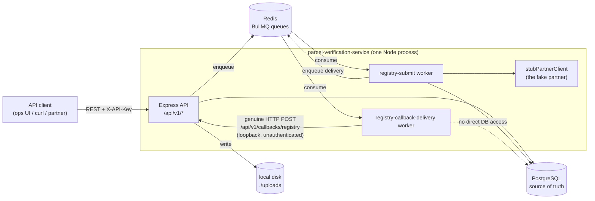
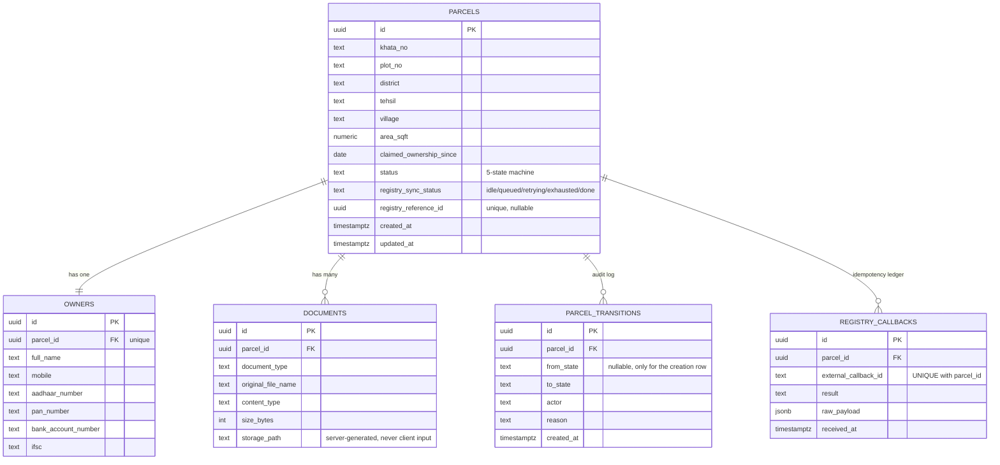
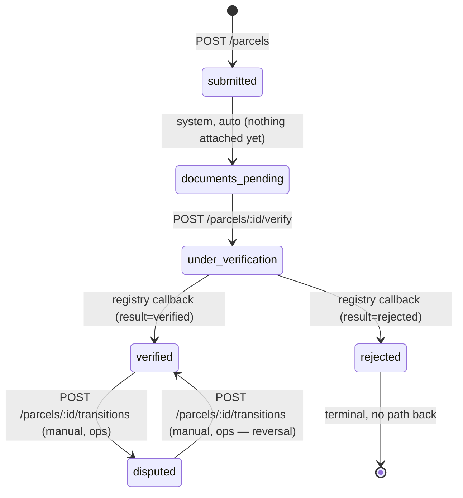
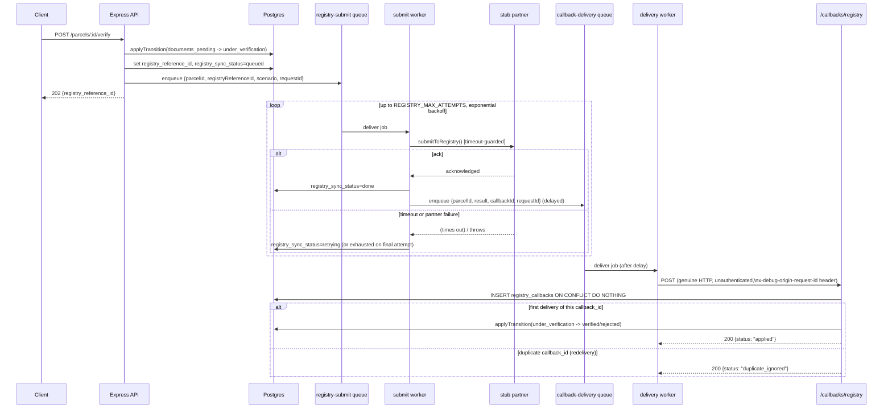

# Architecture Reference

Diagrams render natively on GitHub. This is a reference — for the "what was built,
in what order, and why" narrative, see `docs/IMPLEMENTATION_LOG.md`. For the
API-design and tradeoff reasoning, see the root `README.md`.

## System overview

Everything runs in one process (API + both workers) — the brief rules out
Kubernetes and the time budget didn't call for the added complexity of splitting
them. Each worker is already a standalone `BullMQ.Worker` instance, so moving one
to its own process/container later is an entrypoint change, not a redesign.

## Schema (ERD)

`registry_sync_status` is not part of the brief's 5-state machine — it tracks the
outbound partner call independently, so a stuck call surfaces to an operator
without inventing a 6th business state. See `PARCELS.status` vs
`PARCELS.registry_sync_status` in the state diagram below.

## State machine

Every edge not drawn is a `409 INVALID_TRANSITION` — enforced by
`assertValidTransition` (`src/domain/stateMachine.ts`), the single source of
truth every transition path calls through `applyTransition`
(`src/db/repositories/transitions.repository.ts`).

## Registry verification sequence

The path from "mark ready for verification" through a successful outcome,
showing where retry/backoff and idempotency actually live:

Two details worth calling out from the diagram:

- **The idempotency check runs before the transition is attempted**, in the same
  transaction, keyed on the database's own unique constraint — not an
  application-level `if` check. A duplicate is caught and short-circuited before
  parcel state is touched at all.
- **`registry_sync_status` and `parcel.status` are updated by different actors
  at different times.** The submit worker only ever touches `registry_sync_status`
  (it never knows the actual verification result). The callback handler only
  ever touches `parcel.status` via `applyTransition`. Neither can corrupt the
  other's field.
